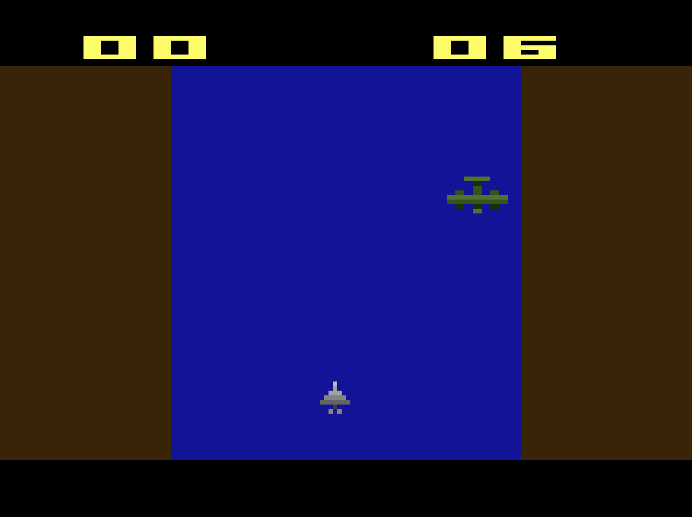

# Jet vs Bomber
Final project for Udemy / Pikuma course: [Learn Assembly Language by Making Games for the Atari 2600](https://www.udemy.com/certificate/UC-3caa9f73-33e6-4dba-8724-6d7a6a758c64/). The course is no longer available for enrollment on Udemy, however it is available on the instructor’s website [Pikuma](https://pikuma.com/courses/learn-assembly-language-programming-atari-2600-games). 

## Gameplay 
Player is a jet fighter plane that must shoot down as many enemy bomber aircraft as possible. For every bomber the jet hits, the score will increase by one. If the bomber ever touches the jet fighter, then the score will reset to zero. The score is displayed in the upper left hand corner of the screen, and a timer is displayed in the upper right hand corner of screen. The game is over when the timer hits 99. The game can be restarted at any time by hitting the Atari reset switch. 

### To play:
1. Download *JetVsBomber.bin* file. This file represents the Atari cartridge. 
2. Open *JetVsBomber.bin* in emulator of your choice. 

### Additions from version in online course:
- Jet and bomber sprites and sprite colors are different from course versions. 
- Different sprites for jet turning left and jet turning right. 
- Different colors for terrain and river from online course. 
- Game ends when timer hits 99. When game is over, the bomber stops coming, the timer stops, background colors change, the jet sound stops, and the jet cannot fire.
- Game can be restarted at any time by hitting the Atari reset switch. 

### Known issues:
- Severe display issues when tested on Atari Flashback Portable. Can safely assume that game will not work properly on original Atari 2600 hardware.

### Notes:
- Tested on [Stella](https://stella-emu.github.io/) version 7.0 and [javatari](https://javatari.org/)
